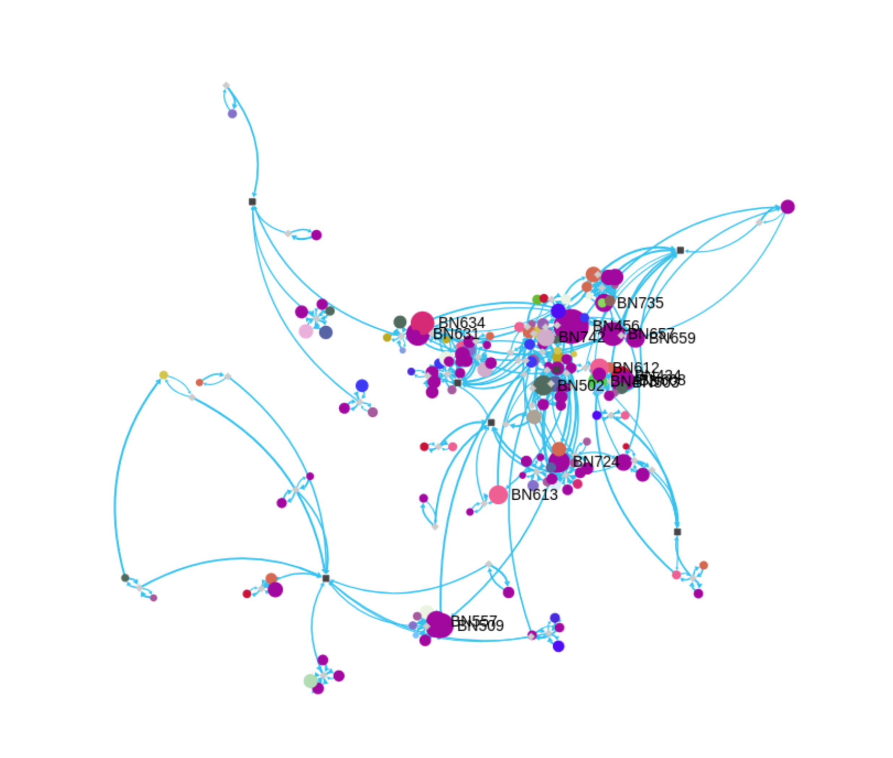

# Epidemic Model Simulation (Graph-Based)

This repo implements (and partially prototypes) the graph-based epidemic modeling approach described in the report “Mô phỏng mô hình lan truyền dịch bệnh” (HUST – Applied Mathematics & Informatics, 2020).

[Report PDF](https://drive.google.com/drive/folders/1JR6GStW_lsP0HNMwBfxJFzTTMIiWzGSH?usp=sharing)
[Report PDF - English](https://drive.google.com/file/d/1Gbmdg5NDLFbCqo8vGfBBwFcQLPl82t5_/view?usp=sharing)
[Report PDF - Vietnamese](https://drive.google.com/file/d/1xIKXLJr5qWOtT-H2t9HZrtYZPUqEp6oo/view?usp=sharing)


<p align="center">
  
</p>

Instead of only using compartmental models (SI/SIR/SEIR), the report treats spread as a **time-varying influence process over a network** (patients + shared locations), and ranks “influential” patients per day using **PageRank**.

## Model summary

### 1) Entities and graph construction
 
The report models the outbreak as a graph $G=(V,E)$.

- **Patient nodes**: each case is a node with attributes such as age group, symptom onset date, and announcement date.
- **Edges**: represent potential transmission influence (direct relationships).
- **Location nodes (optional but important)**: to connect otherwise fragmented patient-only graphs, location nodes (e.g., wards/communes) are added and connected to patients.
  - This encodes indirect links (shared environment) and “unknown source” links among co-located patients.

### 2) Handling missing symptom onset dates

The report highlights that onset dates are often missing. It defines

$$\Delta = (\text{onset date}) - (\text{last contact date})$$

and fits a distribution to observed $\Delta$ values (using Anderson–Darling for goodness-of-fit and MLE for parameters). Missing onset dates are then imputed by sampling $\Delta$.

### 3) Time-varying edge weights and PageRank

The report proposes a **daily weighted influence network**. Edge weights vary over time, peaking around symptom onset and decaying afterward. The weight combines:

- relationship-type strength,
- age-group mixing,
- intervention/media factors,
- (when using locations) a short surface-survival window (e.g., ~3 days) and an indirect transmission decay factor $\gamma$.

Each day $t$, PageRank is computed on the weighted network to identify the most “influential” cases at time $t$.

## What this repository currently implements

The code in [server/](server/) provides a lightweight prototype pipeline to:

1) transform raw case CSV → relationship CSV,
2) load the graph into Neo4j,
3) export graph JSON for visualization (Sigma.js),
4) compute PageRank on the exported graph (in the notebook).

## Repository layout

- [server/](server/): data prep + Neo4j import + analysis/export tooling
- [visualization/](visualization/): Sigma.js-based viewer reading `visualization/data.json`

Key files in [server/](server/):

- `data.csv`: raw case table (Vietnamese column names)
- `relation_new.csv`: processed edge list (also includes a `relationship` id column in this repo)
- `Generate data.ipynb`: builds an edge list from `data.csv`
- `Update DB.ipynb`: loads `relation_new.csv` into Neo4j (nodes + typed edges)
- `Graph.ipynb`: pulls Neo4j → igraph, computes PageRank, exports JSON
- `pass_igraph.py`: quick Neo4j → igraph → JSON export (clusters + colors)
- `test.py`: minimal Neo4j driver wrapper used by `pass_igraph.py`

## Quickstart

### Prerequisites

#### 1. Start Neo4j Database

The easiest way to run Neo4j locally is using Docker Compose:

```bash
docker-compose up -d
```

This will start Neo4j 5.15.0 with:
- **Browser UI**: http://localhost:7474
- **Bolt Protocol**: bolt://localhost:7687
- **Credentials**: username=`neo4j`, password=`123`

Check if Neo4j is ready:
```bash
docker-compose logs neo4j | grep "Started"
```

To stop Neo4j:
```bash
docker-compose down
```

**Alternative**: If you have Neo4j installed locally or running on a remote server, update the `.env` file with your connection details:
```env
NEO4J_URI=bolt://your-host:7687
NEO4J_USERNAME=neo4j
NEO4J_PASSWORD=your-password
```

#### 2. Python Dependencies

Install required Python packages:

```bash
pip install pandas numpy neo4j python-dotenv python-igraph
```

Security note: The default credentials are `neo4j` / `123`. Update `.env` before using in production.

### End-to-end workflow (Refactored Python Modules)

The modern pipeline uses refactored Python modules in the `src/` directory.

#### Quick Start - One Command

Run the complete pipeline with a single command:

```bash
python src/main.py
```

This will:
1. Process raw data (`data.csv` → `relation_new.csv`)
2. Migrate to Neo4j (create nodes and relationships)
3. Calculate PageRank and export visualization JSON

#### Advanced Usage

Run specific pipeline steps:

```bash
# Process data only
python src/main.py --step process

# Migrate to Neo4j only
python src/main.py --step migrate

# Calculate metrics only
python src/main.py --step analyze
```

Additional options:

```bash
# Force re-import even if data exists
python src/main.py --force

# Skip if files already exist
python src/main.py --skip-existing

# Custom output path
python src/main.py --output-json custom/path/output.json

# View all options
python src/main.py --help
```

#### Manual Step-by-Step

Alternatively, run each module individually:

1) **Process raw data**

```bash
python src/components/data_processing.py
```

This converts `server/data/data.csv` → `server/data/relation_new.csv` with processed relationships.

2) **Migrate to Neo4j**

```bash
python src/components/migrate_graph_db.py
```

Loads nodes (patient cases) and relationships (transmission links) into Neo4j.

3) **Calculate metrics and export visualization**

```bash
python src/models/calculator.py
```

This:
- Fetches graph data from Neo4j
- Computes PageRank influence metrics
- Identifies outbreak clusters
- Exports `visualization/data.json` for Sigma.js

4) **View the visualization**

Open [visualization/index.html](visualization/index.html) in a browser to see the interactive epidemic network with:
- Nodes sized by PageRank (influence)
- Color-coded clusters
- Interactive exploration (drag, zoom, click)

### Legacy workflow (Jupyter Notebooks)

The original notebooks in `server/` are still available:

1) **(Optional) regenerate relationship CSV**

Open and run [server/Generate data.ipynb](server/Generate%20data.ipynb) to produce an edge list.

2) **Load into Neo4j**

Open and run [server/Update DB.ipynb](server/Update%20DB.ipynb). It creates:

- nodes labeled by age group (`G1`, `G2`, `G3`, `G4`)
- relationship types mapped from the `relationship` column:
  - `0` → `Unknown`
  - `1` → `Staff_Patience`
  - `2` → `Fellow`
  - `3` → `Relatives`
  - `4` → `Social`

3) **Export JSON for visualization**

Option A (notebook): run [server/Graph.ipynb](server/Graph.ipynb) and it writes `visualization/data.json`.

Option B (script):

```bash
cd server
python pass_igraph.py
```

4) **View**

Open [visualization/index.html](visualization/index.html). It reads `visualization/data.json`.

## JSON format written for Sigma.js

Both export paths create a Sigma.js-like JSON:

```json
{
  "nodes": [{
    "id": 0,
    "label": "BN416",
    "x": 0,
    "y": 0,
    "size": 2,
    "_color": "#34c0eb"
  }],
  "edges": [{
    "id": 0,
    "source": 0,
    "target": 1,
    "weight": 0.42,
    "type": "Relatives"
  }]
}
```
